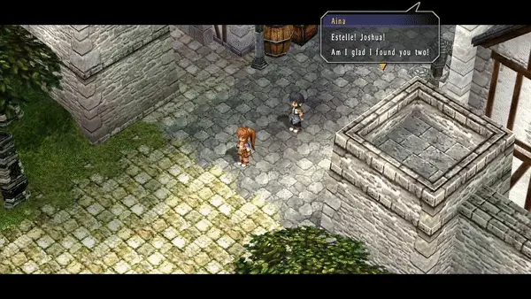

# Step 4: Camera

In step 2, we covered how to make our characters move. While this can be a
useful tool on its own, one limitation is that characters can't move too far
without leaving the screen; even in cases where they are still on screen, it
can look awkward to have characters standing along the edge of the screen. With
that being the case, we can manipulate our camera in order to solve these
problems and expand the limits of what our characters can do!

The primary function to cover here is `CamLookPos`, which directly changes the camera
position. Let's take a look at `t0100` to see how this works. In this scene in
the FC prologue scene, Aina tells Estelle and Joshua that Luke and Pat have
gone missing.



```clm
fn[44]:
	EventBegin 0
	CharFlagsUnset char[0] 0x0080
	CharSetPos char[0] (51370, 0, 29175) 180deg
	ForkFunc name[0] fork[0] fn[0,45]
	ForkFunc name[1] fork[0] fn[0,46]
	ForkFunc char[0] fork[0] fn[0,47]
	ForkFunc field_party[0] fork[1] fn[0,48]
	TextTalk char[0] {
		#21591vEstelle! Joshua!
		Am I glad I found you two!{wait}
	}
	TextWait
	TextClose 0
	Sleep 100ms
	CrossFade 1000ms
	CharSetPos name[0] (49700, 0, 15020) 315deg
	CharSetPos name[1] (48380, 0, 15120) 0deg
	CharSetPos char[0] (49950, 0, 25270) 180deg
	CamZoom 3000 0ms
	CamLookPos (50250, 0, 16110) 0ms
	CamRotate 156000mdeg 0ms
	CamSetDistance 0 7000 -10000 0ms
	FadeWait
	CharWalkToPos char[0] (49200, 0, 19490) 5000mm/s 0
	TextTalk name[0] {
		#00282v#004FOh, hi, Aina!{wait}
	}
	TextWait
```

Specifically, we want to look at this line.

```clm
	CamLookPos (50250, 0, 16110) 0ms
```

Let's change it!

```clm
	CamLookPos (55000, 0, 16110) 0ms
```


Now, the camera has been shifted in the positive X direction, which is toward
the left in this case. It should be noted that the camera angle in both cases
isn't directly straight-on -- there's a slight angle to our perspective, as
specified by the `CamRotate` instruction. Thus, when we moved our camera along
the X axis, our view was both moved to the left and slightly upwards as well,
matching our camera rotation.

As an aside, we can also note that even though we didn't touch Estelle's
dialogue at all, her text box has actually moved. Unless specified, the game
will automatically place the text box, and its decision can be influenced by
where the character is on screen. Please keep that in mind as you're messing
with the camera position!

------

We have discussed changing where the camera looks *at* with `CamLookPos`. Next,
we will look at how to change where it's looking *from*. This is done primarily by
`CamSetDistance`.

```clm
	CamSetDistance 0 7000 -10000 0ms
```

Since the camera angle that we see in the original scene doesn't look
particularly peculiar, it might not be immediately clear what this line is
doing in the first place. Let's remove this line of code and see what the scene
looks like without this positioning!


※Please note that due to a relative lack of experience with camera positioning,
some of this info may not be wholly accurate. This guide will be updated as we
establish a better understanding of how it works.

It's a little bit more subtle than our `CamLookPos` example, but our new
version without the `CamSetDistance` line has the camera higher up; our
characters' sprites are smaller, and the building in the foreground is less
on-screen. Now, let's add `CamSetDistance` back in and change the parameters to
see what we can do.

```clm
	CamSetDistance 5000 10000 -10000 0ms
```


Now, our camera is definitely doing something funky! It's now rotated clockwise
thanks to the X-direction, and our characters are further away thanks to the
Y-position. There's seldom a need for custom camera rotations for ordinary
activities, but being aware of how to set camera height in particular can be
quite useful.

Please note that while our example of Rolent supports full camera rotation,
there are some areas that have fixed camera angles. Such areas may not be fully
textured on all sides, so there are some limitations of how much the camera
rotation can be manipulated while retaining scene quality. As we have not done
a lot of camera rotations in our own work, there may be other bugs that we are
not aware of when it comes to using `CamSetDistance`.

------

Finally, let's look at crossfading. Luckily for us, the instruction to look for
is just called `CrossFade`. Piece of cake!

```clm
	CrossFade 1000ms
	CharSetPos name[0] (49700, 0, 15020) 315deg
	CharSetPos name[1] (48380, 0, 15120) 0deg
	CharSetPos char[0] (49950, 0, 25270) 180deg
	CamZoom 3000 0ms
	CamLookPos (50250, 0, 16110) 0ms
	CamRotate 156000mdeg 0ms
	CamSetDistance 0 7000 -10000 0ms
	FadeWait
	CharWalkToPos char[0] (49200, 0, 19490) 5000mm/s 0
```

Thank Aidios, it's a simple function with only one parameter! `CrossFade` takes
a snapshot of what is currently on screen, and smoothly fades that over to what
is to be displayed next. Usually, like in this example, this is followed by
instantaneously changing some character or camera positions, which produces a
this nice fading effect.

Interestingly, though, there's a second piece of the `CrossFade` puzzle. To
demonstrate this, let's remove the `CrossFade` line of code and see what
happens.


Our camera moves immediately to its new location, as we expected. However, Aina
also moves towards Estelle and Joshua a lot faster in our new version. None of
the other lines of code are altered, so why does removing `CrossFade` affect Aina?

This is because in our original version, Aina was waiting for the crossfade to
finish before she started her movement. Since we removed the fade, Aina was
able to start moving immediately, causing her to reach Estelle and Joshua
faster in our new version. This functionality is caused by the instruction
`FadeWait`!

`FadeWait` is even simpler than `CrossFade` itself! This instruction simply
tells the script to not continue any further until the fade effect[^fade] finishes.
Aina's movement (`CharWalkToPos`) is after this `FadeWait` function, causing
the delay. Let's add back in the `CrossFade`, but this time, let's remove
`FadeWait` and see what happens!


This time, since we have reincluded the `CrossFade` function, we see our camera
fade, just like the original. However, since we've removed `FadeWait`, Aina
will begin walking even as the camera is fading; if we look closely, we can
even see Aina come into view before the effect is fully over, while in the
original, Aina only moves once the effect is completed. As a result, the
dialogue begins earlier in our modded version!

There may be times where it will be appropriate to not include `FadeWait`, such
as when you'd like to imply that the actions are on-going during a fade to the
new camera angle. Other times, we might want to include it, such as if we want
to ensure characters don't speak while the camera effect is still on-going.
`FadeWait` can be a useful tool for fixing up the timing of your scenes, so
please use it accordingly!

There isn't really anything that can be done with `FadeWait` that can't be done
just as well with `Sleep`, but `FadeWait` makes it much easier to get the
timing just right. Besides, it makes it clearer to readers of the script what
exactly it's waiting for.

We've now covered the basics of camera work with camera position and rotation
and fade effects. With camera movement, your scenes will now be much more
dynamic and interesting to watch!

[^fade]:
  `FadeWait` does not only apply to `CrossFade`, but a few other kinds of fading that
  will covered in future sections.
