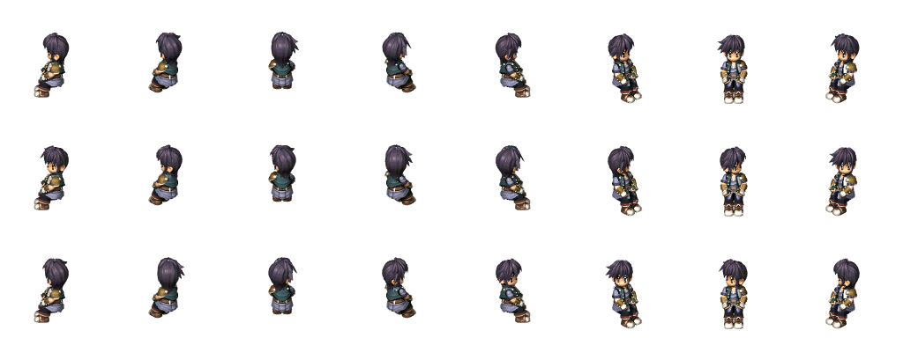
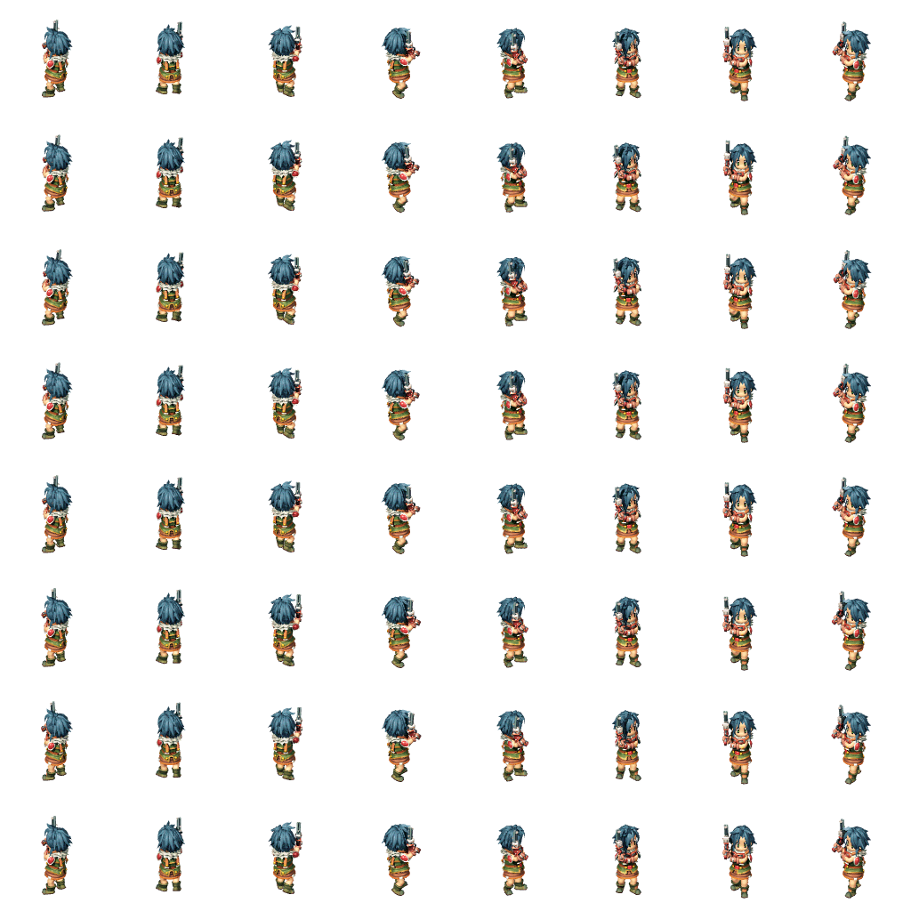

# Step 6: Character Sprites (Chips)

Up until this point, we have not had to manually change character sprites.
However, the game has already been handling the basic character sprite changes
for us; when a character changes direction or moves, the game is automatically
changing the character's sprites to show their walk/run animation. Of course,
there are many different character sprites for each character, so there may be
times when we would like to switch their sprites. For that, we can use the
`CharSetChipBase` and `CharSetChipPattern` functions!

First off, let's note that the game refers to sprites as "Chips". It's not
immediately what the reason is behind this naming convention, but any reference
to chips will in fact be talking about sprites.

Let's start by learning about patterns. For this, let's take a look at `t0310`
for a scene in the prologue of FC, when Estelle and Joshua are talking to
Cassius about their bracer training. In this first clip, as Cassius asserts his
dominance over the Bright household, Joshua turns to look at Estelle.


Shortly afterwards, Estelle looks at Joshua and reveals how much she's been paying attention.


Here's this scene in the code:

```clm
	TextTalk char[0] {
		#19622v#081FThat's the spirit!
		Let's see what you're made of then,
		shall we?{wait}
	}
	TextWait
	CharSetChipPattern char[1] 2
	Sleep 300ms
	TextTalk char[1] {
		#07618v#017F#6PLet's not start a rivalry here, you two...{wait}
	} {
		#07619v#010FAnd Estelle, keep your focus on the task at
		hand.{wait}
	} {
		#07620v#010FWe have a test later on today, remember?{wait}
	}
	TextWait
	CharSetChipPattern char[2] 1
	Sleep 300ms
	TextTalk char[2] {
		#00084v#004FHuh...?! {wait}
	} {
		#00085v...{wait}
	} {
		#00086v#501FWait...what test?{wait}
	}
	TextWait
```

Here, we can see the first function that we'll be covering: `CharSetChipPattern`.

```clm
	CharSetChipPattern char[1] 2
```

In step 2, we covered how we can use `CharTurnToChar` and `CharTurnTo` to have
characters turn to face another character or a specific direction. However, in
this case, Joshua and Estelle aren't turning their bodies; rather, they're only
moving their heads. These head-turned sprites are considered different sprites!
Using the *falcnvrt* tool, we can open the sprite files and convert them to PNG
files for us to view. Here's Joshua's sitting sprite, `npl/ch00013`[^npl]
(lightly edited for browser viewing):



And here is where the pattern comes into play! The top (0th) row is Joshua
looking straight ahead, viewed from all eight directions. The middle (1st) row
is similar, except Joshua looks to the left. Finally, the bottom (2nd) row is
Joshua looking to the right, just like what happens in this scene. As such,
`CharSetChipPattern` takes in 2 as its second parameter here to get Joshua to
look to his right. Similarly, when Estelle looks to her left, she uses 1 as the
2nd parameter. Turning heads while sitting down is just one example of using
`CharSetChipPattern` to switch between different sprites in the same sprite
file.

[^npl]:
  It is unclear what exactly `npl` means, but sprites in this folder refer to
  humans. There is also `mons` for monsters, and `apl` for miscellaneous.

------

So now that we've learned how to use different sprites in the same file, or
patterns, but how can we switch to sprites in different files? For this, we'll
use `CharSetChipBase`!

Let's take a look at `c0302` for at a scene in the FC prologue, when Josette
sheds her Jenis Royal Academy uniform to reveal her true colors.


Here is the same code for this scene:

```clm
		TextTalk char[0] {
			#18184v#219FHey, that's my line!{wait}
		}
		TextWait
		Fork char[0] fork[2]:
			CamZoom 3000 1000ms
		Fork char[0] fork[3]:
			CamLookPos (-60120, -80, 3200) 1000ms
		Sleep 500ms
		EffStop eff_instance[0] 0
		SoundPlay sound[203] 0 0 100
		CharTurnTo char[0] 32deg 800deg/s
		CharSetChipBase char[0] chip[0]
		CharTurnTo char[0] 330deg 800deg/s
		CharTurnTo char[0] 180deg 800deg/s
		Sleep 500ms
		ForkWait char[0] fork[2]
		TextTalk char[0] {
			#18185v#210FAll right boys, get 'em!{wait}
		}
		TextWait
```

Up until this point, we've been able to read and write code in one section of
the file without worrying about anything else in the file. However, looking
within this function, there is no list of sprites for `CharSetChipBase` to
refer to. In fact, this information is up at the top of the file, in these
lines:

```clm
chip[0] "npl/ch00310._ch" "npl/ch00310p._cp"
chip[1] "npl/ch00311._ch" "npl/ch00311p._cp"
chip[2] "npl/ch00314._ch" "npl/ch00314p._cp"
chip[3] "npl/ch00360._ch" "npl/ch00360p._cp"
chip[4] "npl/ch00361._ch" "npl/ch00361p._cp"
```

This lists two filenames per line, but they are almost always the same but with
a `p` and a different extension. Unless you want to create custom sprites, you
won't have to pay much attention to that part.

Anyway, this is where sprite information for NPCs is stored! Since Estelle and
Joshua are `name[n]`, their sprite information is normally read from
`t_name._dt` rather than from here. But Josette is a `char[n]`, so she will be
using data from here.

Now, checking our `CharSetChipBase`, we are looking for `chip[0]`.
We can see quite easily that this is `npl/ch00310`, which looks as below:



Now that we know how to choose a sprite for our character, we can alter our
`CharSetChipBase` function call to select a different sprite; better yet, we
can even change the contents of the `chip[n]` declarations to bring in sprites
that weren't traditionally in the file!

Let's try to change what sprite Josette transforms into by swapping her sprites
with someone else's.

```clm
chip[0] "npl/ch00160._ch" "npl/ch00160p._cp" // Tita's standing sprite
chip[1] "npl/ch00161._ch" "npl/ch00161p._cp" // Tita's running sprite
```

Note that in this case, we've changed both `chip[0]` and `chip[1]`, replacing
them with Tita's standing and running sprites respectively. Now, look at what
happens when Josette transforms!


Now, we've changed both Josette's standing and running sprites. While we
haven't had to worry about the difference between standing and running sprites
up until now with our party members, NPCs don't have any of these behaviors
built in. Let's check what happens if we replace only `chip[0]`, leaving
`chip[1]` as-is:


The game engine will not know to look for Tita's running sprite simply because
her standing sprite is being used -- if you look a little farther down, there's
another line `CharSetChipBase char[0] chip[1]`, so it'll simply use that sprite
and not care which character it portrays.

Using the `CharSetChipBase` and `CharSetChipPattern` functions, we can customize what
our characters look like, giving us a whole new level of opportunities for
custom stories! 
