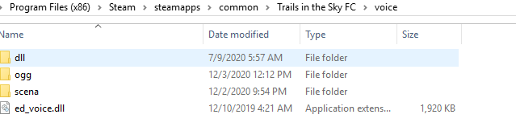

# Modding Trails in the Sky for Senior Bracers

> So you'd like to mod Trails in the Sky, aspiring bracer?

This page is an adaptation (with permission) of ShinKiseki's [Modding Trails in
the Sky for Junior Bracers][junior] guide, changed to use my [Calmare][Aureole]
decompiler rather than the venerable [EDDecompiler].

This guide is primarily concerned about modding scena (short for scenario)
files. These are essentially a series of scripts that tells the game's engine
about each scene in the game -- which characters are in the scene, where they
are positioned in the world, what they are saying, and so on.

Aside from this introductory chapter, the guide works equally well for the
Crossbell duology as well; most of the functionality is identical. Crossbell
doesn't need any setup, so you can skip this section. One thing to note,
however, is that Crossbell's scripts are named `.bin` rather than *Sky*'s `._sn`.

## Setup

The game normally loads these from inside a file named `ED6_DT01.dat`. This
file is not possible to edit by hand, so we will need some extra tools. We
could use [Factoria](../factoria.md) to extract the scripts from the archive.
But nobody would be happy if you made mods not compatible with SoraVoice, so
we'll use its scripts instead.

1. Install the game and find its installation directory, normally
   `C:\Program Files (x86)\Steam\steamapps\common\Trails in the Sky FC`.
   It should look something like this:

   

2. Optional, but recommended: download `SoraVoice_*.7z` from [SoraVoice], and
   extract its contents into the game directory.

   

3. Download `en.fc_*.7z` from [SoraVoiceScripts]. It will contain a `scena/`
   folder; place that inside the `voice` directory.

   

5. If you wish, install the voice files themselves. These are most easily
   downloaded from [archive.org].
   The voice files go in the `ogg` directory, depicted above.

6. Install [LB-ARK](../lb-ark.md) and run its `move_sora_voice.ps1` script.
   This is a small system that simplifies various aspects of *Sky*'s file handling.

7. Check that the mod is running. An easy way to do this, aside from just
   checking if there are voices playing, is that it will create a file named
   `ed_voice.ini` in the `voice` directory. If this file is not created,
   something went wrong.

If you've gotten curious and looked inside the `._sn` files, you may have
noticed that they are just binary data. This format is suited for the game to
read, but it is not readable by humans. To convert them to something that is
useful for humans, we will use [Calmare][Aureole]. Simply download the latest
[`calmare.exe`][calmare-latest] and place it somewhere easily accessible.

Next, go to `data\ED6_DT01` and drag `c0100._sn` onto `calmare.exe`. A `c0100.clm`
file will appear next to it, with a (hopefully) nice and readable syntax. To
convert back to `._sn`, simply drag the `.clm` file onto `calmare.exe` again.

Hopefully, this guide will help you, aspiring Sky modder, set up your game to
properly mod your game!

As you may expect, prior experience with coding/scripting is extremely
beneficial. However, this guide is aimed to be accessible even for those who
have not programmed in the past. Each line of code that we examine will be
explained via comments, so we hope this will be easy to understand even for the
newest of bracers!

[junior]: https://docs.google.com/document/d/1Nflb-dBPLLl0yWwk3MJTo0UxNyRPZDgy5zPanSrtotM/
[EDDecompiler]: https://github.com/Ouroboros/EDDecompiler
[SoraVoice]: https://github.com/ZhenjianYang/SoraVoice/releases
[SoraVoiceScripts]: https://github.com/ZhenjianYang/SoraVoiceScripts/releases/
[Aureole]: https://github.com/Kyuuhachi/Aureole
[calmare-latest]: https://github.com/Kyuuhachi/Aureole/releases/latest/
[archive.org]: https://archive.org/details/trails-evo-voices
