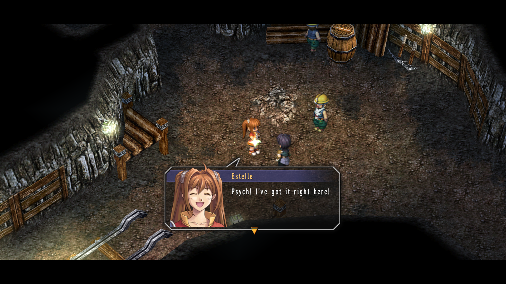

# Step 1: Character Dialogue

In the previous step, we used Calmare to create the file `c0100.clm`. Let's
open it and take a look!

```clm
calmare fc scena
scena:
	name "Rolent" "C0100.x"
	town town[14]
	bgm bgm[30]
	item fn[0,65535]

entry:
	pos (25000, 0, 9000)
	chr 4
	angle 0deg
	cam_from (0, 9500, -10000)
	cam_at (0, 0, 0)
	cam_zoom 2800
	cam_pers 262
	cam_deg 315deg
	cam_limit 0deg 360deg
	north 0deg
	flags 0x0000
	town town[14]
	init fn[0,0]
	reinit fn[0,1]
```

There's a *lot* of content in here, much of which is still not understood.
For the purposes of this tutorial, we aren't going to be covering every line of
code you'll find in these scripts. However, scroll further down in the file and
there will be more easily parsed content: dialogue. Let's take a look at this
line of dialogue.

```clm
	Emote name[0] 0mm 2000mm emote[8,9,250ms] 2
	SoundPlay sound[15] 0 0 100
	Sleep 1000ms
	TextTalk name[0] {
		#00631v#001FPsych! I've got it right here!{wait}
	} {
		#00632v#001FLet's go make that delivery,
		shall we?{wait}
	}
	TextWait
```

This is from a scene in the Malga Mine in Rolent early in FC, right after
Estelle and Joshua acquire a large chunk of septium. As seen here, dialogue is
written out in plain text within this `TextTalk` instruction. When the game
reaches this part of the script, Estelle will say this dialogue.




```clm
	TextTalk name[0] {
		#00631v#001FPsych! I've got it right here!{wait}
	} {
		#00632v#001FLet's go make that delivery,
		shall we?{wait}
	}
	TextWait
```

Most of this should be fairly self-explanatory, but there are a number of things to note:

- `name[0]` refers to Estelle. What each number there refers to is defined in a
  file named `t_name._dt`, but for now, just remember thta `name[0]` is Estelle
  and `name[1]` is Joshua.

- Line breaks inside the dialogue are kept as-is.

- `#00631v` - Syntax like this is used for various kinds of text formatting and
  similar. The `v` specifier, like here, it is used to play voice clips with the
  dialogue. I do not know how this maps to a filename.

- `#001F` - The `F` specifier sets the portrait that is shown next to the text.
  It refers to the file `h_kao###._ch`[^kao] (顔 *kao* is Japanese for "face").

- `{wait}` - Tells the game to wait for the user to press a key before
  continuing. You'll see this one on almost every dialogue box.

- `TextWait` - Waits for the previous dialogue box be closed by the user.
  Again, you'll see this on almost every dialogue.

Now, let's change the portraits and dialogue:

```clm
	TextTalk name[0] {
		#00631v#414FIt's best girl Josette!{wait}
	} {
		#00632v#855FCuteness is justice,
		right?{wait}
	}
	TextWait
```

Save the file and drag it onto `calmare.exe`. Finally, the first fruits of your
labor can be seen!


As seen above, it is possible to change the dialogue and the shown portraits!

[^kao]:
  In later games you may see four-digit numbers. They map to `h_ka####._ch`,
  with the "o" being cut off.
