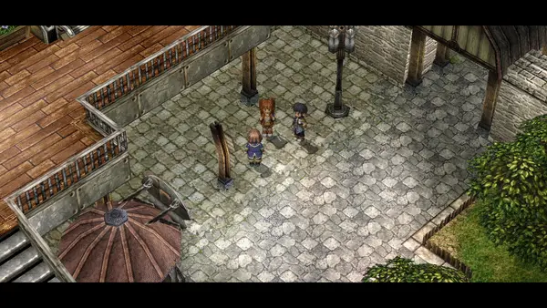
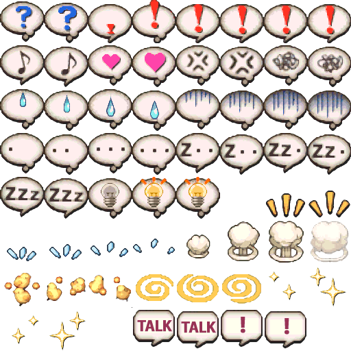
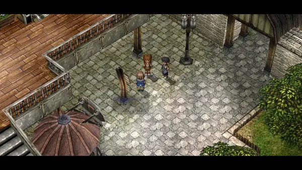

# Step 3: Emotes

Our Sky cast often uses emotes to express different sentiments, both while
they're talking and in response to other characters. Emotes provide a lot of
charm and help liven up dialogue, so while not essential to telling a story,
they are an excellent complement. How do we use emotes?

Let's take a look at a scene in the FC prologue, when Estelle and Joshua are
talking to businessman Orvid about a mushroom he wants them to collect. This is
`t0700`.



Estelle doesn't comprehend the unnecessarily snarky insinuation Orvid makes.
The code for this sequence is:

```clm
	TextTalk self {
		#27019v...Oh well, I guess you'll
		have to do.{wait}
	}
	TextWait
	Emote name[0] 0mm 2000mm emote[0,1,250ms,2]
	SoundPlay sound[38] 0 0 100
	Sleep 400ms
	TextTalk name[0] {
		#06102v#501FPardon?{wait}
	}
	TextWait
```

Here's one example of `self` being used. Since this function was invoked by
talking to Orvid, `self` refers to him. There's no reason they couldn't just
have written `char[5]` here, but that's how it is.

Let's take a closer look at this line.

```clm
	Emote name[0] 0mm 2000mm emote[0,1,250ms,2]
```

The `name[0]` is, of course, which character does the emoting -- Estelle. The
`0mm` and `2000mm` are horizontal and vertical offset, respectively. Horizontal
offset is almost always zero, except for example if the character is lying in a
bed. Vertical offset is usually 2000mm for most characters, 1700mm for Tita or
other children, as well as characters who are sitting down, and 2300mm for Zin.

So what's the deal with the four parameters in `emote[]`? Well, the game has a
single instruction that is used to generate all the emotes, as opposed to one
instruction for each emote. The game contains a file that contains all of the
emote images laid out in a grid, named `h_emotio._ch`. Here's what `h_emotio`
looks like:



So `emote[0,1,250ms,2]` means showing images 0 through 1 (the question mark
ones), for 250ms each, and run this animation twice. Some emotes such as the
exclamation mark are shown just once, with short time between each frame.
Others, such as the question mark here, have longer but fewer frames, and
repeated several times. The `Emote` instruction can handle all that.

A leaked script file has revealed names for a few of the emotes:

|Name|Content|Meaning|
|:-|:-|:-|
|`BIKKURI`|`emote[2,7,80ms,1]`|exclamation mark|
|`RUNRUN`|`emote[8,9,250ms,2]`|music note|
|`MUKA`|`emote[12,13,250ms,2]`|angry|
|`HIYAASE`|`emote[16,19,250ms,1]`|sweatdrop|
|`TENTENTEN`|`emote[24,27,250ms,0]`|...|
|`ZZZ`|`emote[28,33,250ms,?]`|sleep|
|`WAIWAI`|`emote[38,39,250ms,2]`|cheerful|

Okay, so it seems like we have a handle on how to make emotes appear. Let's
change Estelle's reaction to Orvid's snide comment to a nice `MUKA`!

```clm
	Emote name[0] 0mm 2000mm emote[12,13,250ms,2]
```


At the risk of being emotionally manipulative, we've now changed Estelle's
reaction!

------

But, something feels a little off about this. In fact, the sound effect hasn't
changed! A lot of these emotes have a little sound effect that plays
concurrently. The question mark and anger emotes have different sound effects,
but we're still currently playing the question mark emote's sound effect.
What's going on here?

In fact, `Emote` only handles the visuals for these emotes. The sound effects
are handled by the next line of code that appears, in `SoundPlay`. Which you
might have guessed from the name.

```
	SoundPlay sound[38] 0 0 100
```

Please note that the arguments other than the first are unknown. In fact, they
seem to differ between the Liberl and Crossbell games! But for the most part
you'll only need to care about the first.

The only challenge is knowing which sound effects go with which emote. They
correspond to files named `ed6se###.wav`. There is no comprehensive list of
what each of them means, but here's a short list of common ones:

|ID|Meaning|
|:-|:-|
|`sound[6]`|open door|
|`sound[7]`|close door|
|`sound[15]`|happy emote (Heart, music note)|
|`sound[17]`|received item|
|`sound[38]`|question mark|
|`sound[39]`|exclamation mark|
|`sound[49]`|unhappy emote (anger, sweat drop, despair)|

So in this case we will want to change the `sound[38]` to a `sound[49]`.

There are also some emotes (the three panic sweat drops, thinking ellipsis)
that don't have any sound effect associated with them -- any time you find them
in the scena files, you'll notice that there is no call to `SoundPlay`. While we
don't have as comprehensive a list as we'd like, we now have a way to both show
and hear our emotes!

------

However, there is still a little bit more to learn about showing emotes in a
natural manner. If we take a look at the code again, we'll find a very unassuming,
but very important instruction between the ones we have learned thus far.

```clm
	TextTalk self {
		#27019v...Oh well, I guess you'll
		have to do.{wait}
	}
	TextWait
	Emote name[0] 0mm 2000mm emote[12,13,250ms,2]
	SoundPlay sound[38] 0 0 100
	Sleep 400ms
	TextTalk name[0] {
		#06102v#501FPardon?{wait}
	}
	TextWait
```

What is this `Sleep` instruction? If you know programming terminology, you'll
probably have guessed that it simply makes the script pause for the specified
duration. This is essential to making scenes flow at the right pace.

This instance of `Sleep` is seen between an emote and dialogue, but there are
many places where `Sleep` can be used to get the correct timing! If something
feels off about the pacing of your scripts, there's a good chance that a
well-placed `Sleep` or two are exactly what you're looking for.

Pretty simple in functionality, but `Sleep` is a deceptively powerful tool for
making the game just FEEL good. Let's take a look at what would happen if we
remove `Sleep` altogether from the original scene.

```clm
	Emote name[0] 0mm 2000mm emote[12,13,250ms,2]
	SoundPlay sound[38] 0 0 100
	// Sleep 400ms // Removing sleep
	TextTalk name[0] {
		#06102v#501FPardon?{wait}
	}
	TextWait
```



The emote kinda overlaps with the dialogue and feels a bit rushed and
cluttered. Sleep allows Estelle to transition more seamlessly from her emote to
the dialogue!

Of course, there are limits to how liberally Sleep can be used. Let's look at
what would happen if we increase the length of Sleep drastically:

```clm
	Emote name[0] 0mm 2000mm emote[12,13,250ms,2]
	SoundPlay sound[38] 0 0 100
	Sleep 2000ms // Don't. Care. SLUMBER!
	TextTalk name[0] {
		#06102v#501FPardon?{wait}
	}
	TextWait
```


Pretty big difference, huh? The amount of time spent using `Sleep` can
significantly influence the feel of a scene, so `Sleep` responsibly!

------

The final major topic to cover regarding emotes is the indefinite emote. Up
until now, we've covered emotes that naturally go away after a period of time,
after a certain number of loops through the emote images. You may be wondering
what it would mean for an animation to repeat zero times; well, you're in luck,
because that's exactly what this section is about.

Sometimes characters will show an emote indefinitely until some other
event, such as another character speaking, comes to stop the dialogue.
This is done by setting the number of loops to zero. Let's test this out by
giving Joshua an indefinite emote:

```chr
	TextTalk name[0] {
		#06102v#501FPardon?{wait}
	}
	TextWait
	Emote name[1] 0mm 1700mm emote[24,27,250ms,0]
	TextTalk self {
		#27020v*cough* ...Never mind, I was just
		talking to myself.{wait}
	}
	TextWait
	TextTalk self {
		#27021vAll right, let's get down to business.
		Please excuse my lack of decorum,
		but I'm in a bit of a hurry.{wait}
	}
```


As expected, Joshua's emote isn't going away. We need some way to get rid of
these emotes at some point. For that, we can use `EmoteStop`!


```chr
	TextTalk name[0] {
		#06103v#006FSure.{wait}
	}
	TextWait
	EmoteStop name[1]
	TextTalk self {
		#27022vAt the moment, I'm looking for a rare
		mushroom called the 'Firefly Fungus'.{wait}
	}
```

Now, we can expect Joshua's emote to disappear once Estelle finishes her line
of dialogue:


That wraps things up for the emotes section! We've now learned the process for
making emotes appear and disappear, including how to make specific emotes
appear at specific locations. With this tool at your disposal, your dialogue
will be much livelier!
