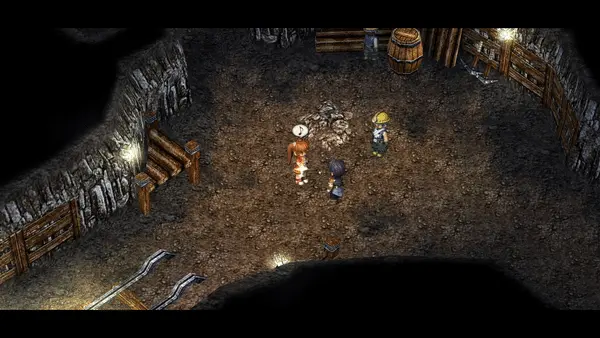
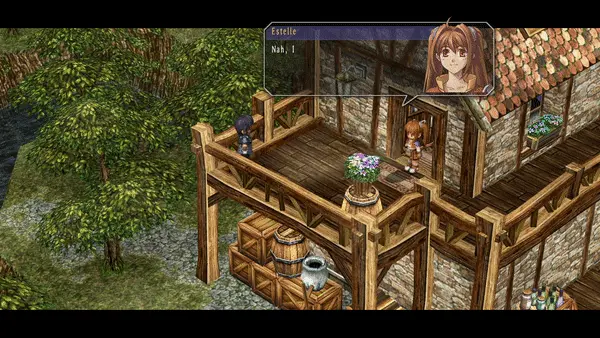
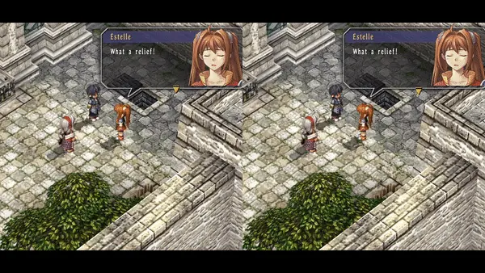

# Step 2: Character Movement

Now that we've gone over the basics of changing text, the next thing we'll
cover is character movement. The first thing we'll cover is putting a character
at a specific point on the map. To do so, we can use `CharSetPos` (set character
position).

Continuing to examine `c0100.clm`, let's look a little further up in the file,
at this code block:

```clm
fn[15]:
	EventBegin 0
	CharSetPos char[7] (27100, -500, 13125) 180deg
	CharSetPos name[0] (26230, 0, 10530) 0deg
	CharSetPos name[1] (27600, 0, 10640) 0deg
	CharSetPos char[3] (39350, 0, 26280) 0deg
	CharSetPos char[4] (24110, -40, 15950) 0deg
	CharSetPos char[5] (10800, 0, 29530) 0deg
	CharSetPos char[6] (54240, 0, 53990) 0deg
	ItemRemove item[802] 1
	_Char4A char[7] 0
	SystemFlagsUnset 0x00000001
	CamLookChar name[0] 0ms
	TextTalk char[7] {
		#26815vI apologize for getting you involved
		in more than your fair share of work
		today.{wait}
	}
	TextWait
```

The first thing to note here is that there is a `fn[15]:` line right at the
top. Each scena file has a bunch of functions that correspond to various events
that happen at a specific location. As we've mentioned, `c0100` relates to the
Malga Mine, so all the events and dialogue in this file take place in Malga
Mine.

So how does this relate to `CharSetPos`? As different story events will have
different characters standing in different places, the scena file needs to tell
the game where to place characters. Oftentimes, this means that at the top of a
function, you will see a bunch of `CharSetPos` to place all the characters at the
correct positions. You can use these as a reference whenever you need to set a
character's position! 

Now, let's take a look at `CharSetPos` itself.

```clm
	CharSetPos name[0] (26230, 0, 10530) 0deg
```

You may notice that some lines say `char[n]` while others say `name[n]`. These
are different ways to refer to characters. Unlike `name[n]`, which refers to a
global set of characters that is the same in every script, `char[n]` refers to NPCs (or
monsters) defined in the current scena file. You will also frequently encounter
`self` and `null`, as well as a few less common kinds.

Okay, so we can select an individual character and change their position and
rotation. Let's try doing that right after our new lines of dialogue!

```clm
	TextTalk name[0] {
		#00631v#414FIt's best girl Josette!{wait}
	} {
		#00632v#855FCuteness is justice,
		right?{wait}
	}
	// CharSetPos name[0] (26230, 0, 10530) 0deg
	CharSetPos name[0] (25530, 0, 10530) 0deg
```

Along the bottom here, we've added two new lines of code. The first line is
directly copied from the top of the function, but we've placed a `//` in front,
which makes this a comment. For those new to coding, this means that this line
of code won't do anything -- it is just text to make it easier for you to read
your code! In this case, it is here to be a reference for the second line of
code.

Now, for the second line of code, we've changed the second parameter, the X
position. As we've decreased the X position, we should expect our character,
Estelle, to move in some direction. Let's see what happens!


As expected, Estelle has moved! More specifically, Estelle has moved up to the
top left and has rotated to face the top right. This indicates to us that
negative X points to the top left. 0° rotation corresponds to looking at the
top right. This will be useful to keep in mind!

Next, let's modify the second line of code again. We'll change the X-position
back to what it was before, and we'll change the Z position to a lower value.
Finally, we'll rotate Estelle to 90°. Considering that Estelle previously moved
to the top left, we should Estelle to move in a different direction this time.
Let's try it!

```clm
	// CharSetPos name[0] (26230, 0, 10530) 0deg
	CharSetPos name[0] (26230, 0, 10000) 90deg
```



As expected, Estelle no longer moves to the top left. Instead, she moves to the
bottom left this time! She also no longer turns to face the top right. She
instead stays facing the bottom right.

Testing these two different scenarios has helped us figure out how the X axis
and Z axis are oriented. As a rule, the positive Z axis corresponds to 0°, and
the positive X axis corresponds to 90°, in a clockwise orientation. A diagram
for this is provided below:


Unfortunately, considering that it is possible to rotate the camera, there is
no guarantee that the Z axis is pointing towards the top right specifically.
The compass on the minimap might be of use here, since 0° is to the
north[^north].

There is also currently no way to figure out exactly which coordinates
correspond to which part of the map without trial and error. As a result, it
will require some testing to get your characters facing and moving in the
correct directions. Please keep that in mind as you are working with character
location!


[^north]:
  This is not strictly true: I believe the `north` field on `entry` chunks
  affect the relation between coordinates and the compass. This field is only
  nonzero in three places throughout the entire series, however, so it can
  generally be disregarded.

------

Being able to set a character's position provides us with one useful tool for
modifying scena files, but of course, characters do not typically teleport from
one location. Is there a way to have our characters walk around in a more
natural fashion? The answer is yes!

Let's take a look at the start of FC at the Bright household, when Estelle
finds Joshua playing harmonica. This is `t0301`.


Here, we have a basic example of Estelle walking towards Joshua. How does
Estelle walk to Joshua? Let's examine the code!

```clm
	Fork name[0] fork[1]:
		CamLookPos (-6350, 3450, 3460) 2000ms
	CharWalkToPos name[0] (-6220, 3450, 2860) 2000mm/s 0
	CharTurnToChar name[0] char[0] 400deg/s
	Sleep 100ms
	CharTurnToChar char[0] name[0] 400deg/s
```

There used to be a mess here, but our maintenance team finally finished at
Russell's and had time to look this over. So now it's up to us to create a new
mess of our own. Let's change that `2000mm/s` to make Estelle walk faster!

```clm
	CharWalkToPos name[0] (-6220, 3450, 2860) 5000mm/s 0
```



Instead of walking leisurely to Joshua, Estelle instead bursts over! We can
actually compare the two different clips to see how much faster she is moving:


Indeed, now that we've changed the movement speed, Estelle moves a lot faster!
You may also notice that Estelle uses a different running animation here.
That's certainly convenient, since if a character moves at running speed we
generally do want them to have a running animation. The threshold for this is
not yet known, though.

Combined with our previous knowledge of how to figure out our coordinates, we
can now have our characters walk to any point at any speed...

...Except, of course, if we ask our characters to move to a place they can't
physically walk to. Whether it be walking outside the map or walking into a
wall, there are some potentially weird behaviors that will occur if we don't
select our destinations properly. What happens if, instead of asking Estelle to
walk to Joshua, we ask her to keep walking past him towards the left?

```clm
	CharWalkToPos name[0] (-10000, 3450, 0) 2000mm/s 0
```


Welp. As you can see, the game will not check if the path is valid before
running the script. As a result, poor selection of destinations can result in
some... unexpected behaviors, such as passing through walls. There are also other
cases where characters can get stuck walking forever if they are trying to walk
through an object (a solid wall, another character, etc.) with collision.
Please be careful with using `CharWalkToPos`!

------

One thing you may have noticed with this scene is that Estelle turns to look at
Joshua before continuing her dialogue with him. Perhaps unsurprisingly,
characters turn to look at each other all the time. Certainly, when characters
walk/run, they will face the way they're moving, but it would be convenient to
rotate characters without having to move them, right?

Luckily, we have a tool for this! Let's look at the code again for
`CharTurnToChar`:

```clm
	CharTurnToChar name[0] char[0] 400deg/s
	Sleep 100ms
	CharTurnToChar char[0] name[0] 400deg/s
```

It looks like `CharTurnToChar` is used twice here, and the values are just
flipped around between the first and second times. So how does `CharTurnToChar`
work?

`CharTurnToChar` is an instruction that makes one character turn to face
another over a period of time. Let's test out what happens when we change the
speed of `CharTurnToChar` and place a much lower number.

```clm
	// CharTurnToChar name[0] char[0] 400deg/s
	CharTurnToChar name[0] char[0] 50deg/s
```


Estelle definitely takes a little bit longer to turn here! To get a full
appreciation of the difference, let's compare this clip (right) with the clip
from the unmodded scene (left).


Using `CharTurnToChar`, you'll be able to have your characters look at each other
as they're talking to each other!

------

`CharTurnToChar` is a simple but powerful tool, as it allows characters to look
at each other without figuring out any angles or rotations. However, the more
astute bracers might have noticed that this perk is also its greatest
limitation -- how can characters look in a direction if no one is standing
there? For that, we can use `CharTurnTo`!

Let's take a look at a scene in the FC prologue, where Schera is talking to
Estelle and Joshua about becoming junior bracers. Estelle turns to (rightfully)
praise Aidios[^the-player] when she realizes she doesn't need to take a paper
test. This is `t0100`.


```clm
	TextTalk name[0] {
		#00157v#004F...{wait}
	} {
		#00158v#007FWhat a relief!{wait}
	}
	TextWait
	CharTurnTo name[0] 225deg 400deg/s
	SoundPlay sound[137] 0 0 100
	Emote name[0] 300mm 1600mm 54 57 250ms 0
	Sleep 1000ms
```

Well, you guessed it. This works almost identically to `CharTurnToChar`. We
still have the ID for the character that is turning and the speed at which the
character is turning. The only difference is that second parameter; instead of
a specific character to turn towards, we instead will specify the specific
direction itself. If you've already had a chance to practice specifying
directions with `CharSetPos`, this is the same thing!

Let's practice again by changing which way Estelle is turning:

```clm
	CharTurnTo name[0] 135deg 400deg/s
```


As expected, Estelle turns to the right this time. Now, we have a way of having
our characters turn whatever direction we like!

The final thing to note is that, as `CharTurnToChar` and `CharTurnTo` specify a
speed of turning, longer turns will require a longer period of time. Let's
compare the original turn to face downward (left) with our new turn to face
rightward (right).



Despite starting their turn at the same time, our Estelle on the right has
further to turn, so it's no surprise that she ends up taking more time. This is
normally what you would want, but it is worth keeping in mind as you're moving
and turning your characters.

With that in mind, you have now learned the basics of how to move and turn your
characters! Combined with your knowledge of character dialogue, this should
already be enough to start making simple edits and scenarios. But what if your
scenario needs something… more? Our beloved Sky cast is quite expressive, so we
need a way to have our characters show emotion beyond their portraits.

The next step is learning about emotes!

[^the-player]: Interesting that she turns to face the camera for that. Hmm, implications.
